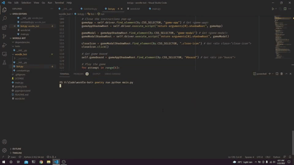

# Wordle Bot
A simple selenium-based bot to play the popular game
[Wordle](https://www.powerlanguage.co.uk/wordle/).

## Implementation
The bot uses a dictionary of possible words and at each attempt, repeatedly
prunes the list using the clues. For additionally advantage, the bot sorts the
word list into an hueristical ordering based on character occurence to further
improve the chances.

[ ] TODO: Write a blog and link here.

## Dependencies
* Python 3.8
* Poetry
* Selenium Web Driver
* Chrome

## Usage
* Download and add chrome selenium web driver to your `PATH`.
* Install dependencies using `poetry install`.
* Run the bot using `poetry run python main.py`.
* Get word list stats using `poetry run python main.py --stats`.
* Heuristic sort word list using `poetry run python main.py --heuristic-sort`.

## Contribute
You are always welcome to open an issue or provide a pull-request!

## License
Built under [MIT](./LICENSE) license.